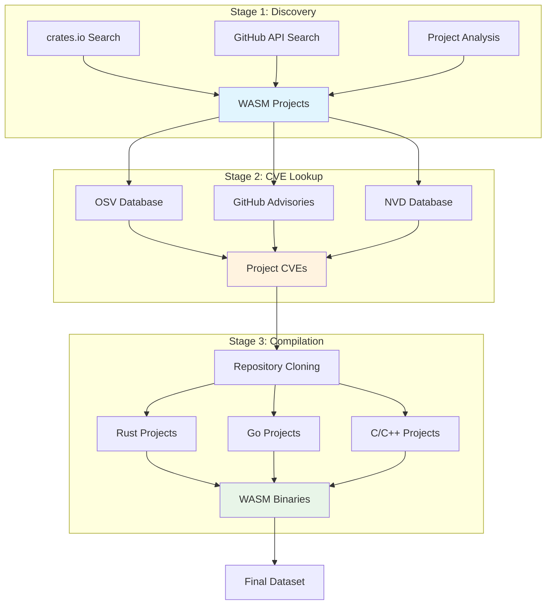
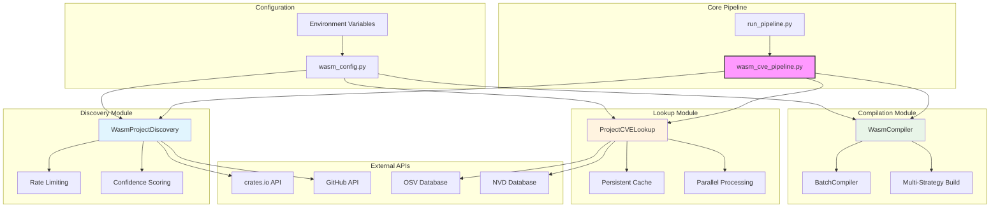
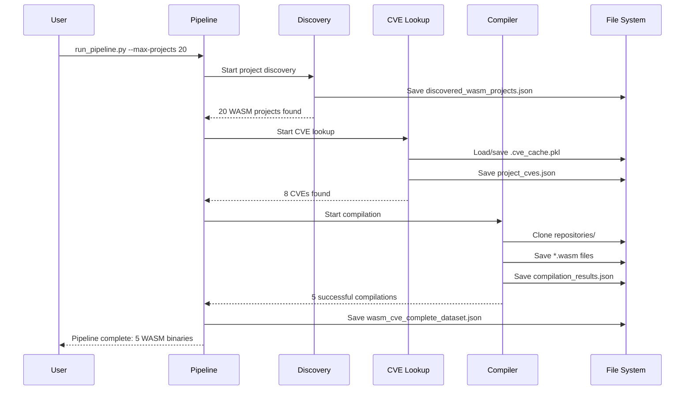
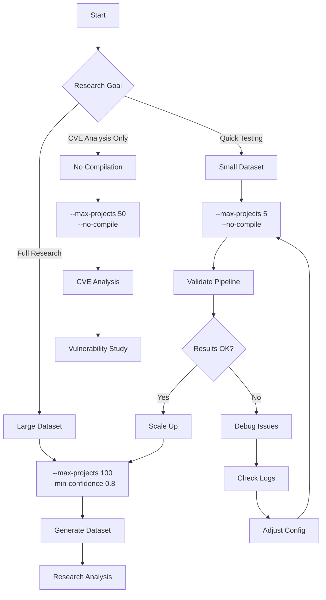

# WASM-V Pipeline Guide

A streamlined pipeline for discovering WASM-capable projects, finding associated CVEs, and compiling vulnerable versions to WASM binaries for security research.

## Overview

The pipeline consists of three main stages:

1. **Discovery**: Find projects that can compile to WebAssembly
2. **CVE Lookup**: Search for vulnerabilities in discovered projects  
3. **Compilation**: Compile vulnerable versions to WASM binaries



## Quick Start

### Prerequisites

```bash
# Required tools
- Python 3.8+
- Rust with WASM target
- Git

# Install Rust WASM target
rustup target add wasm32-unknown-unknown
```

### Installation

```bash
# Clone repository
git clone https://github.com/williamsryan/Wasm-V.git
cd Wasm-V

# Install dependencies
pip install -r requirements.txt

# Optional: Set GitHub token for higher rate limits
export GITHUB_TOKEN="your_github_token_here"
```

### Basic Usage

```bash
# Run with default settings (10 projects)
python run_pipeline.py

# Process more projects
python run_pipeline.py --max-projects 50

# Skip compilation (discovery + CVE lookup only)
python run_pipeline.py --max-projects 20 --no-compile
```

## Pipeline Stages

### Stage 1: Project Discovery

**What it does:**
- Searches crates.io for Rust projects with WASM dependencies
- Uses GitHub API to find projects with WASM build configurations
- Discovers C/C++ projects using Emscripten
- Scores project confidence based on WASM indicators

**Output:** `data/wasm_projects/discovered_wasm_projects.json`

### Stage 2: CVE Lookup

**What it does:**
- Queries OSV database for package vulnerabilities
- Checks GitHub Security Advisories
- Searches NVD database for CVE entries
- Looks for security issues in repositories

**Output:** `data/project_cves/project_cves.json`

### Stage 3: Compilation

**What it does:**
- Clones vulnerable project repositories
- Compiles to WASM using appropriate toolchains
- Tries multiple compilation strategies per project
- Validates and saves successful WASM binaries

**Key features:**
- Supports Rust, Go, C/C++ projects
- Multiple build strategies (binary, library, wrapper)
- Comprehensive error handling and logging
- Deduplication to avoid compiling same repository multiple times

**Output:** `data/compiled_wasm/*.wasm` files

## Configuration

### Environment Variables

```bash
# API Rate Limiting (seconds between requests)
export WASM_OSV_DELAY=0.1         # OSV API delay
export WASM_GITHUB_DELAY=0.3      # GitHub API delay  
export WASM_NVD_DELAY=1.5         # NVD API delay

# Parallel Processing
export WASM_CVE_WORKERS=20        # CVE lookup workers
export WASM_MAX_WORKERS=20        # General workers

# Project Filtering
export WASM_MIN_CONFIDENCE=0.7    # Minimum confidence score
```

### Command Line Options

```bash
python run_pipeline.py --help

Options:
  --max-projects INTEGER     Maximum number of projects to process [default: 10]
  --min-confidence FLOAT     Minimum confidence score for projects [default: 0.7]
  --compile/--no-compile     Whether to compile vulnerable versions [default: compile]
  --output-dir PATH          Output directory for results [default: data]
```

## System Architecture



## Output Structure

```
data/
├── wasm_projects/
│   └── discovered_wasm_projects.json    # All discovered projects
├── project_cves/
│   ├── project_cves.json               # Found CVEs
│   └── .cve_cache.pkl                  # Cached API responses
├── compiled_wasm/
│   ├── *.wasm                          # Compiled binaries
│   └── compilation_results.json       # Compilation metadata
├── repositories/                       # Cloned source code
└── wasm_cve_complete_dataset.json     # Combined results
```

### Data Flow



## Data Formats

### Project Discovery Output

```json
{
  "discovery_timestamp": "2024-01-15T10:30:00Z",
  "total_projects": 150,
  "projects": [
    {
      "name": "wasm-pack",
      "ecosystem": "crates.io",
      "repo_url": "https://github.com/rustwasm/wasm-pack",
      "language": "rust",
      "wasm_confirmed": true,
      "confidence_score": 1.0,
      "discovery_method": "crates_io_search",
      "metadata": {
        "wasm_dependency": true,
        "build_wasm": true
      }
    }
  ]
}
```

### CVE Lookup Output

```json
{
  "lookup_timestamp": "2024-01-15T10:45:00Z", 
  "total_cves": 23,
  "cves": [
    {
      "cve_id": "CVE-2024-1234",
      "source_project": {
        "name": "vulnerable-crate",
        "language": "rust"
      },
      "severity": "high",
      "severity_score": 8.5,
      "description": "Buffer overflow vulnerability",
      "affected_versions": ["1.0.0", "1.1.0"],
      "fixed_versions": ["1.2.0"],
      "wasm_compilation_confirmed": true
    }
  ]
}
```

### Compilation Results

```json
{
  "project_id": "vulnerable-crate_CVE-2024-1234",
  "vulnerability_id": "CVE-2024-1234", 
  "language": "rust",
  "status": "success",
  "wasm_path": "data/compiled_wasm/vulnerable-crate_CVE-2024-1234.wasm",
  "wasm_size": 34827,
  "compilation_time": 12.5,
  "compiler_version": "rustc 1.70.0"
}
```

## Troubleshooting

### Common Issues

**No projects discovered:**
- Check internet connectivity
- Verify GitHub token is set: `echo $GITHUB_TOKEN`
- Try with lower confidence: `--min-confidence 0.5`

**CVE lookup is slow:**
- Increase rate delays if hitting API limits:
  ```bash
  export WASM_GITHUB_DELAY=0.5
  export WASM_NVD_DELAY=2.0
  ```

**Compilation failures:**
- Ensure Rust WASM target is installed: `rustup target list --installed`
- Check that `wasm32-unknown-unknown` is present
- View compilation logs in the output for specific errors

**Cache issues:**
- Clear cache: `rm data/project_cves/.cve_cache.pkl`
- Restart pipeline to rebuild cache

## Usage Workflows



## Integration Examples

### Running Individual Components

```bash
# Discovery only
python -m discovery.wasm_project_discovery

# CVE lookup only (requires existing projects)  
python -m lookup.project_cve_lookup

# Compilation only (requires existing CVEs)
python -m compilation.wasm_compiler --check-toolchains
```

### Batch Processing

```bash
# Process multiple batches
for i in {1..5}; do
    python run_pipeline.py --max-projects 20 --output-dir "data/batch_$i"
done
```

### Research Workflows

```bash
# Quick dataset for testing (5 projects, no compilation)
python run_pipeline.py --max-projects 5 --no-compile

# Full research dataset (100 projects with compilation)  
python run_pipeline.py --max-projects 100 --min-confidence 0.8

# Focus on high-confidence projects only
python run_pipeline.py --max-projects 200 --min-confidence 0.9
```

## Contributing

### Code Structure

- `discovery/` - Project discovery logic
- `lookup/` - CVE search and enrichment  
- `compilation/` - WASM compilation pipeline
- `config/` - Configuration management
- `run_pipeline.py` - Main entry point
- `wasm_cve_pipeline.py` - Core pipeline orchestration

### Adding New Discovery Sources

1. Add new method to `WasmProjectDiscovery` class
2. Update `discover_all_wasm_projects()` to call new method
3. Ensure proper confidence scoring

### Adding New CVE Sources

1. Add new method to `ProjectCVELookup` class  
2. Update `find_cves_for_project()` to call new method
3. Add appropriate caching and rate limiting

### Adding New Compilation Targets

1. Add new compilation method to `WasmCompiler` class
2. Update `compile_project()` routing logic
3. Add toolchain detection to `_check_toolchains()`
