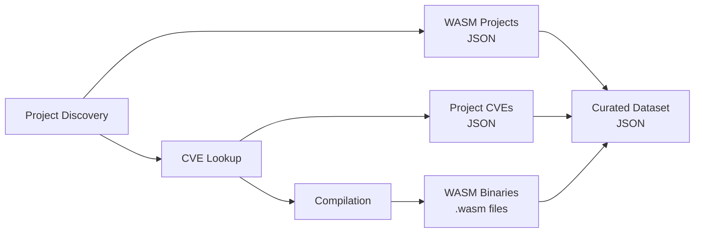

# WASM-V: WebAssembly Vulnerability Dataset Generator

A security research pipeline that generates curated WebAssembly vulnerability datasets. Discovers WASM-capable projects, identifies associated CVEs, and compiles vulnerable versions to WASM binaries for controlled security analysis.

## Research Goals

- **Vulnerability Analysis**: Provide compiled WASM binaries of known vulnerable code for security research
- **Dataset Curation**: Generate structured datasets mapping vulnerabilities to WebAssembly binaries  
- **Security Testing**: Enable controlled analysis of WebAssembly security issues

## Pipeline Overview



## Quick Start

```bash
# Install dependencies
pip install -r requirements.txt
rustup target add wasm32-unknown-unknown

# Set up environment
cp .env.example .env
# Edit .env and add your GitHub token

# Activate virtual environment (if using one)
source .venv/bin/activate

# Generate small research dataset
python run_pipeline.py

# See all options
python run_pipeline.py --help
```

## Usage Examples

```bash
# Generate small research dataset (10 projects)
python run_pipeline.py

# Large dataset with high-confidence projects  
python run_pipeline.py -n 100 -c 0.8

# Focus on Rust projects with critical vulnerabilities
python run_pipeline.py -l rust -s critical -n 25

# Discovery phase only for exploration
python run_pipeline.py --discovery-only -n 50

# Preview without execution
python run_pipeline.py --dry-run -l rust -n 20
```

## Dataset Structure

```
data/
├── wasm_cve_complete_dataset.json              # Complete curated dataset
├── wasm_projects/                              # Discovered WASM-capable projects
├── project_cves/                               # CVE mappings & vulnerability data
├── compiled_wasm/                              # WASM binaries for security analysis
│   └── *.wasm                                  # Individual vulnerable binaries
└── repositories/                               # Cloned vulnerable source code
```

## Configuration

## Environment Setup

Copy the example environment file and configure:

```bash
cp .env.example .env
# Edit .env with your GitHub token and preferences
```

Or set environment variables directly:

```bash
export GITHUB_TOKEN="your_github_token"         # GitHub API access (recommended)
export WASM_MAX_WORKERS=20                      # Parallel processing threads
export WASM_MIN_CONFIDENCE=0.8                  # Project confidence filter
export WASM_COMPILATION_TIMEOUT=15              # Compilation timeout (minutes)
```

## Requirements

- **Python 3.8+** with pip
- **Rust toolchain** with WASM target: `rustup target add wasm32-unknown-unknown`
- **Git** for repository cloning
- **GitHub token** (optional but recommended for API rate limits)

## Documentation

- **[Quick Reference](QUICKREF.md)** - Common workflows and commands
- **[Manual Page](MANUAL.md)** - Comprehensive documentation  
- **[Development Guide](.github/copilot-instructions.md)** - Architecture and AI coding guidelines

## Citation

If you use WASM-V in your research, please cite our work:

**WASM-V: A Unified Vulnerability Aggregation Platform for WebAssembly Security Research** (Under submission)  
[Preprint available on arXiv](https://arxiv.org/)

```bibtex
@article{wasmv2025,
  title={WASM-V: A Unified Vulnerability Aggregation Platform for WebAssembly Security Research},
  author={},
  journal={arXiv preprint},
  year={2025},
  note={Under submission}
}
```

## Security Notice

This tool processes known vulnerable code and generates potentially dangerous binaries. Use in isolated environments and handle outputs with appropriate security measures.

## Contributing

This is a security research tool. Please ensure any contributions maintain the focus on controlled vulnerability analysis and dataset generation for legitimate security research purposes.
